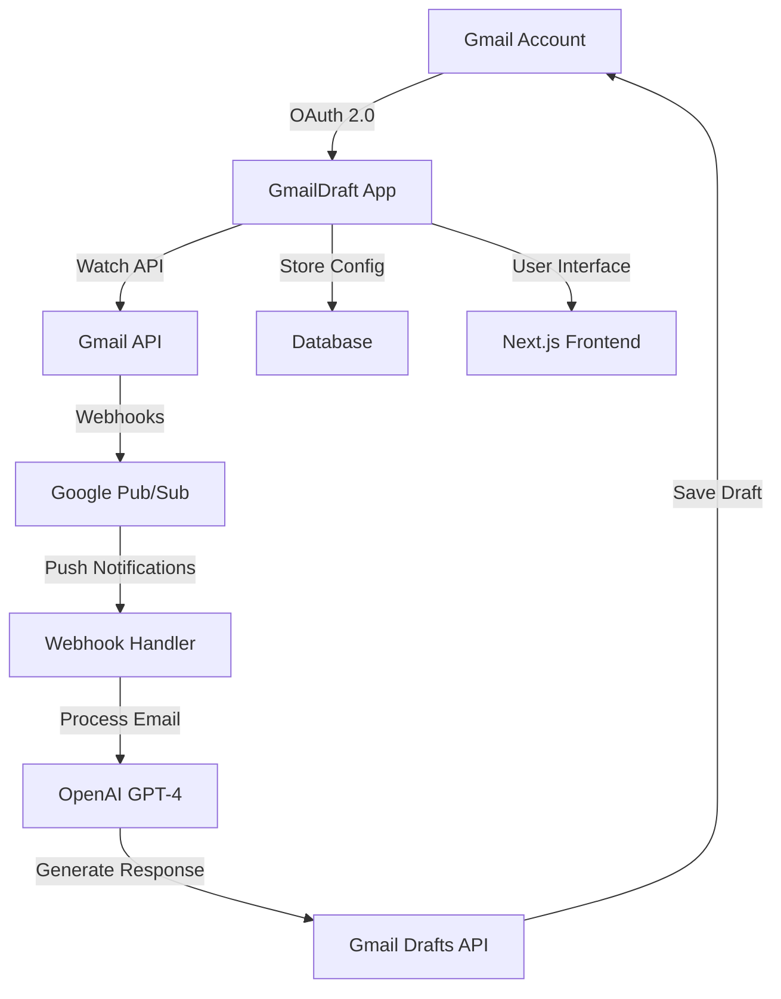

# 📧 GmailDraft

<div align="center">


**AI-powered email assistant that automatically generates smart draft responses in your Gmail**

[](https://opensource.org/licenses/MIT) [](https://www.typescriptlang.org/) [](https://nextjs.org/) [](https://openai.com/)

[What is GmailDraft?](#-what-is-gmaildraft) • [Features](#-features) • [Quick Start](#-quick-start) • [Setup Guide](#-detailed-setup-guide) • [Contributing](#-contributing)

</div>

---

## 🎯 What is GmailDraft?

GmailDraft is an intelligent email assistant that monitors your Gmail inbox and automatically generates professional draft responses using AI. Once set up, it works silently in the background, analyzing incoming emails, understanding their intent, and creating contextual draft replies that appear directly in your Gmail drafts folder.

### 📹 Demo Video

<div align="center">
  
  [](https://www.youtube.com/watch?v=u2NotfJzGNY)
  
  **[▶️ Watch GmailDraft in action on YouTube](https://www.youtube.com/watch?v=u2NotfJzGNY)**
  
</div>

### ✨ Key Benefits

- **🤖 AI-Powered**: Uses GPT-4 to understand email context and generate relevant responses
- **⚡ Automatic**: Works in the background - no manual intervention needed
- **🔒 Privacy-First**: Email content is never stored, only processed
- **🎨 Customizable**: Configure tone, add FAQs, and personalize responses
- **📱 Native Gmail**: Drafts appear directly in Gmail - no new interface to learn

---

## 🌟 Features

### Core Functionality
- **Gmail Integration**: Secure OAuth 2.0 connection with Gmail API
- **Real-time Monitoring**: Uses Gmail Watch API with Pub/Sub for instant notifications
- **Smart Classification**: AI-powered email intent analysis and categorization
- **Automated Drafts**: Professional responses generated and saved to Gmail drafts
- **Custom Context**: Personalized FAQs and business information for accurate responses

### User Experience
- **Dashboard**: Monitor email activity and AI processing status
- **Settings Panel**: Configure response tone, custom instructions, and FAQs
- **Activity Logs**: Track processed emails, intents, and confidence scores
- **Privacy Controls**: Full transparency and control over data processing


*GmailDraft Dashboard - Monitor email processing, confidence scores, and draft creation status*


*Settings Panel - Configure AI tone, custom instructions, FAQs, and Gmail integration*

### Technical Features
- **Scalable Architecture**: Built on Next.js with serverless API routes
- **Database Simple**: SQLite with Prisma ORM - zero configuration
- **Modern UI**: Responsive design with Tailwind CSS and shadcn/ui
- **Type Safety**: Full TypeScript implementation

---

## 🚀 Quick Start

### Prerequisites

- Node.js 18+ and npm/pnpm/yarn
- A Google Cloud Project with Gmail API and Pub/Sub enabled
- OpenAI API key (with GPT-4 access)
- Database (SQLite - included, no setup required)
- Public URL for webhooks (ngrok for development)

### 1. Clone and Install

```bash
git clone https://github.com/paabloLC/gmail-ai-draft.git
cd gmail-ai-draft
npm install
```

### 2. Environment Setup

Copy the environment file and configure your variables:

```bash
cp .env.example .env.local
```

Fill in your `.env.local` with the required values:

```env
# Database
DATABASE_URL="file:./dev.db"

# NextAuth
NEXTAUTH_URL="http://localhost:3000"
NEXTAUTH_SECRET="your-nextauth-secret-key-here"

# Deployment Configuration
MULTI_USER_MODE=false
OWNER_EMAIL="your-email@example.com"

# Google OAuth (from Google Cloud Console)
GOOGLE_CLIENT_ID="your-google-client-id.apps.googleusercontent.com"
GOOGLE_CLIENT_SECRET="your-google-client-secret"

# OpenAI
OPENAI_API_KEY="sk-proj-your-openai-api-key-here"

# Google Cloud Pub/Sub
GOOGLE_CLOUD_PROJECT_ID="your-project-id"
PUBSUB_TOPIC="projects/your-project-id/topics/gmail-notifications"
WEBHOOK_URL="https://yourdomain.com/api/gmail/webhook"
```

### 3. Database Setup

```bash
npm run db:push
```

### 4. Run Development Server

```bash
npm run dev
```

Visit `http://localhost:3000` to start using GmailDraft!

---

## 📋 Detailed Setup Guide

### Google Cloud Configuration

1. **Create a Google Cloud Project**
   - Go to [Google Cloud Console](https://console.cloud.google.com)
   - Create a new project or select existing one

2. **Enable Required APIs**
   ```bash
   # Enable Gmail API
   gcloud services enable gmail.googleapis.com
   
   # Enable Pub/Sub API
   gcloud services enable pubsub.googleapis.com
   ```

3. **Create OAuth 2.0 Credentials**
   - Go to APIs & Services → Credentials
   - Create OAuth 2.0 Client IDs
   - Add authorized redirect URIs:
     - `http://localhost:3000/api/auth/callback/google` (development)
     - `https://yourdomain.com/api/auth/callback/google` (production)

4. **Create Pub/Sub Topic and Subscription**
   ```bash
   # Create topic
   gcloud pubsub topics create gmail-notifications
   
   # Create subscription
   gcloud pubsub subscriptions create gmail-subscription \
     --topic=gmail-notifications \
     --push-endpoint=https://yourdomain.com/api/gmail/webhook
   ```

### OpenAI Setup

1. Get your API key from [OpenAI Platform](https://platform.openai.com/api-keys)
2. Make sure you have sufficient credits for GPT-4 usage

### Database Setup

**SQLite (Default - No installation required)**
```bash
# SQLite database is created automatically
# No additional setup needed!
```


---

## 🏗️ Architecture Overview



### Components

- **Frontend**: Next.js app with Tailwind CSS for user dashboard and settings
- **API Routes**: Next.js serverless functions for Gmail and AI integration
- **Database**: Prisma ORM with user preferences, FAQs, and email logs
- **Gmail Integration**: OAuth 2.0, Watch API, and Drafts API
- **AI Processing**: OpenAI GPT-4 for email analysis and response generation
- **Real-time Sync**: Google Pub/Sub for instant email notifications

---

## 📁 Project Structure

```
gmail-ai-draft/
├── app/                          # Next.js app directory
│   ├── page.tsx                 # Landing page
│   ├── layout.tsx               # Root layout
│   ├── globals.css              # Global styles
│   ├── providers.tsx            # Context providers
│   ├── dashboard/               # Dashboard pages
│   │   ├── page.tsx            # Main dashboard
│   │   └── settings/           # Settings page
│   └── api/                     # API routes
│       ├── auth/               # NextAuth configuration
│       ├── dashboard/          # Dashboard APIs
│       └── gmail/              # Gmail API integration
│           ├── watch/          # Setup Gmail Watch
│           ├── webhook/        # Pub/Sub webhook handler
│           └── handler/        # Email processing logic
│
├── components/                   # Reusable UI components
│   └── ui/                     # shadcn/ui components
│
├── lib/                         # Utility libraries
│   ├── auth.ts                 # NextAuth configuration
│   ├── db.ts                   # Database connection
│   ├── gmail.ts                # Gmail API client
│   ├── openai.ts               # OpenAI client
│   ├── pubsub.ts               # Google Pub/Sub client
│   └── utils.ts                # Utility functions
│
├── prisma/                      # Database schema and migrations
│   └── schema.prisma           # Prisma schema
│
├── public/                      # Static assets
├── .env.example                 # Environment variables template
├── package.json                 # Dependencies and scripts
└── README.md                    # This file
```

---

## 🔧 Configuration

### Environment Variables

| Variable | Description | Required |
|----------|-------------|----------|
| `DATABASE_URL` | Database file path (SQLite) | ✅ |
| `NEXTAUTH_URL` | NextAuth URL for authentication | ✅ |
| `NEXTAUTH_SECRET` | NextAuth secret key for session encryption | ✅ |
| `MULTI_USER_MODE` | Enable multi-user mode (`true`) or self-hosted mode (`false`) | ✅ |
| `OWNER_EMAIL` | Email address of the instance owner (required only if `MULTI_USER_MODE=true`) | ⚠️ |
| `GOOGLE_CLIENT_ID` | Google OAuth client ID | ✅ |
| `GOOGLE_CLIENT_SECRET` | Google OAuth client secret | ✅ |
| `OPENAI_API_KEY` | OpenAI API key for GPT-4 access | ✅ |
| `GOOGLE_CLOUD_PROJECT_ID` | Google Cloud project ID | ✅ |
| `PUBSUB_TOPIC` | Full Pub/Sub topic path | ✅ |
| `WEBHOOK_URL` | Public webhook URL for Gmail notifications | ✅ |

### Deployment Modes

GmailDraft supports two deployment modes to fit different use cases:

#### 🏠 **Self-Hosted Mode** (Default: `MULTI_USER_MODE=false`)
- **Perfect for**: Personal use or single organization
- **Gmail Integration**: Visible to all users who sign up
- **Setup**: Anyone can configure Gmail Watch for their own emails
- **Use case**: You want to run GmailDraft for yourself or your team

#### 👥 **Multi-User Mode** (`MULTI_USER_MODE=true`)
- **Perfect for**: SaaS-style deployment serving multiple customers
- **Gmail Integration**: Only visible to the designated owner
- **Setup**: Owner configures once, all users benefit automatically
- **Use case**: You want to offer GmailDraft as a service to others

#### Configuration Examples:

**Self-Hosted (Default):**
```env
MULTI_USER_MODE=false
# OWNER_EMAIL not needed - everyone can configure Gmail Watch
```

**Multi-User Service:**
```env
MULTI_USER_MODE=true
OWNER_EMAIL="admin@yourcompany.com"
```

#### How it works:
- **Self-hosted**: Every user sees "Gmail Integration" panel and can set up their own Gmail Watch
- **Multi-user**: Only the owner sees "Gmail Integration" panel, configures once for everyone

### Gmail API Scopes

The application requires the following Gmail API scopes:
- `https://www.googleapis.com/auth/gmail.readonly` - Read email messages
- `https://www.googleapis.com/auth/gmail.modify` - Create drafts and manage labels
- `https://www.googleapis.com/auth/gmail.settings.basic` - Set up watch notifications

---

## 🎛️ Usage

### Setting Up Gmail Integration

1. **Sign In**: Use the "Get Started with Google" button on the homepage
2. **Grant Permissions**: Allow GmailDraft to access your Gmail account
3. **Setup Gmail Watch**: Click "Setup Gmail Watch" in the dashboard to enable real-time monitoring

### Configuring AI Responses

1. **Business Tone**: Choose from Professional, Friendly, Formal, or Casual
2. **Custom Instructions**: Add specific guidelines for AI responses
3. **FAQs**: Add frequently asked questions and answers for better context
4. **Auto-respond**: Toggle automatic draft creation on/off

### Monitoring Activity

- **Recent Email Activity**: View processed emails with intent classification and confidence scores
- **Draft Status**: See which emails resulted in successful draft creation
- **Performance Metrics**: Track AI accuracy and response quality

---

## 🚨 Troubleshooting

### Common Issues

**Gmail Watch Setup Fails**
```bash
# Check if APIs are enabled
gcloud services list --enabled

# Verify Pub/Sub topic exists
gcloud pubsub topics list

# Test webhook endpoint
curl -X POST https://yourdomain.com/api/gmail/webhook
```

**Database Connection Issues**
```bash
# Test database connection
npm run db:push

# Check Prisma client generation
npm run db:generate
```

**OpenAI API Errors**
- Verify API key is valid and has sufficient credits
- Check if you have access to GPT-4 models
- Monitor rate limits in OpenAI dashboard

**Webhook Not Receiving Events**
- Ensure Pub/Sub topic and subscription are created
- Verify webhook endpoint is publicly accessible
- Check Google Cloud Pub/Sub logs


---

## 🤝 Contributing

We welcome contributions! Please see our [Contributing Guide](CONTRIBUTING.md) for details.

### Development Setup

1. Fork the repository
2. Create a feature branch: `git checkout -b feature/amazing-feature`
3. Make your changes and add tests
4. Commit your changes: `git commit -m 'Add amazing feature'`
5. Push to the branch: `git push origin feature/amazing-feature`
6. Open a Pull Request


---

## 📄 License

This project is licensed under the MIT License - see the [LICENSE](LICENSE) file for details.

---

## 🙏 Acknowledgments

- [Next.js](https://nextjs.org) for the amazing full-stack framework
- [OpenAI](https://openai.com) for powerful language models
- [Google](https://developers.google.com/gmail/api) for Gmail API
- [shadcn/ui](https://ui.shadcn.com) for beautiful UI components

---

<div align="center">

**Made with ❤️ and Claude Code**

[⭐ Star this repo](https://github.com/paabloLC/gmail-ai-draft) • [🍴 Fork it](https://github.com/paabloLC/gmail-ai-draft/fork)

</div>